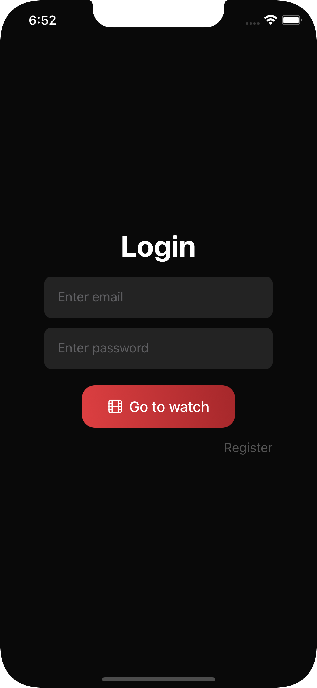
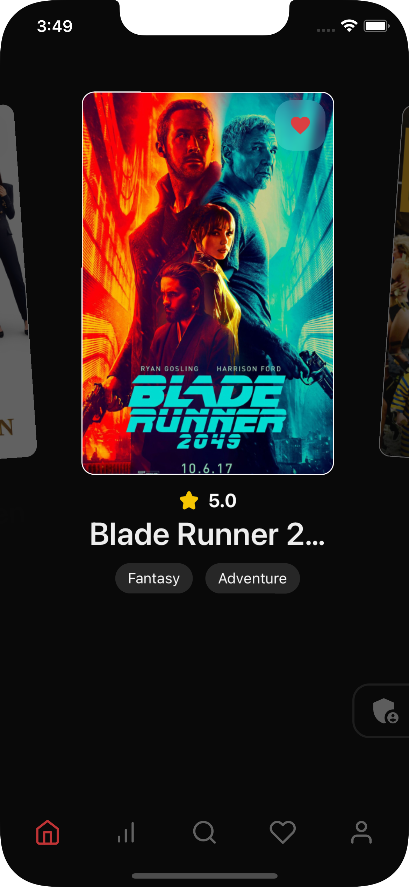
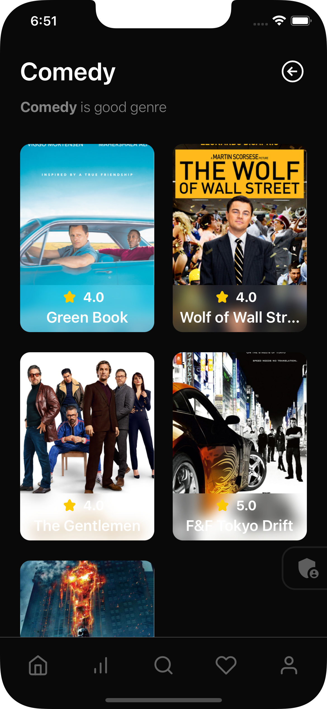
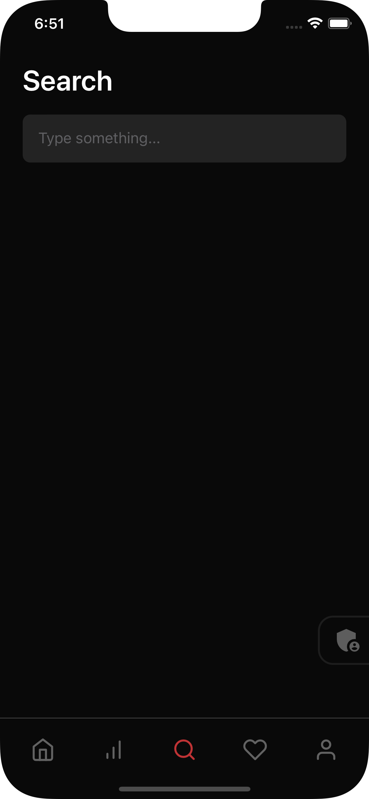
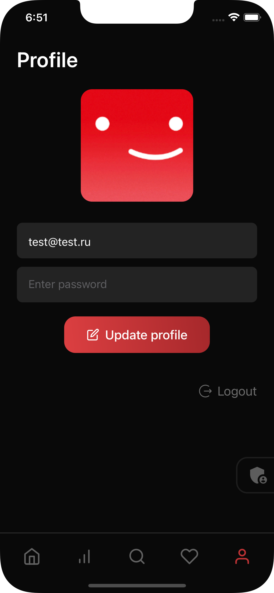

# Мобильно приложение онлайн кинотеатра

### *В проекте использовались следушее технологии*

### Backend

### Frontend

## *Ниже приведены скришоты приложения*

## 
1. Страница авторизации

  

## 
2. Главная страница

  

## 
3. Страница жанров

  

## 
4. Страница поиска
 

  

## 
5. Страница профиля
 

  

